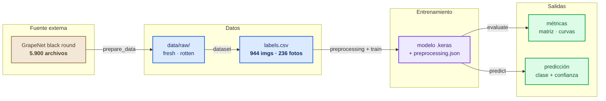
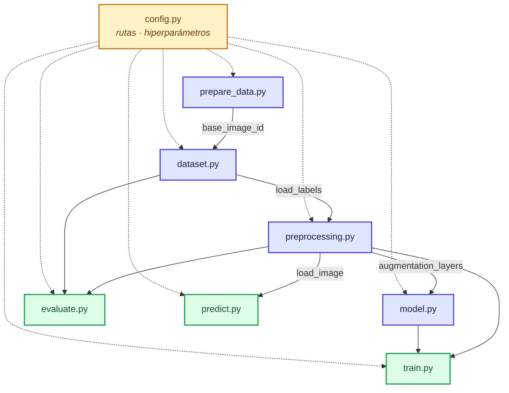
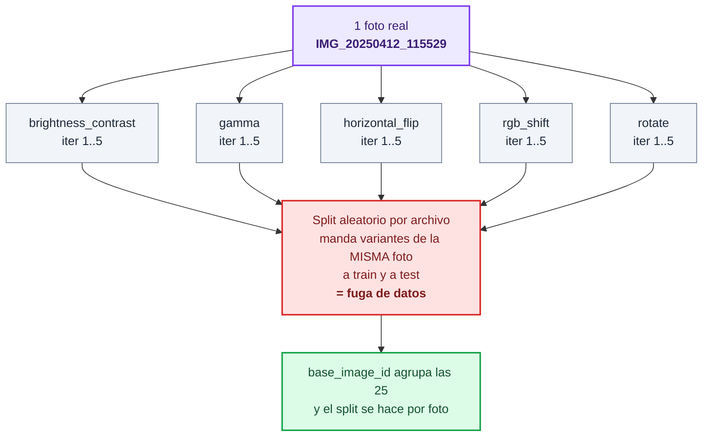
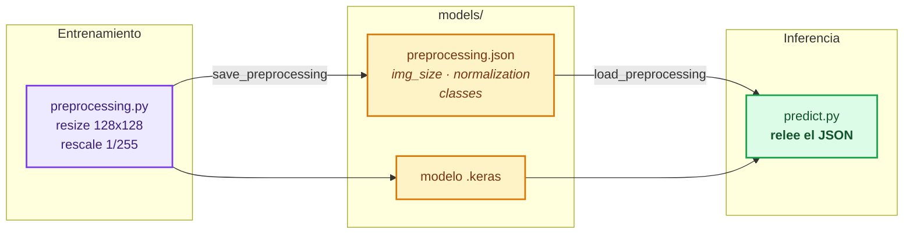

# Arquitectura del proyecto

Clasificador binario de uvas negras **fresh / rotten** a partir de imágenes.
Este documento explica cómo está armado el proyecto y por qué.

---

## 1. Vista general

El proyecto es un pipeline lineal de cinco etapas. Cada etapa es un módulo
ejecutable (`python -m src.<modulo>`) que lee lo que dejó la anterior y escribe un
artefacto en disco. No hay orquestador ni estado compartido en memoria: el contrato
entre etapas son los archivos.



---

## 2. Módulos

| Módulo | Responsabilidad | Produce |
| --- | --- | --- |
| `config.py` | Rutas, clases, hiperparámetros, semilla | — |
| `prepare_data.py` | Descomprime el subset e identifica la foto original de cada archivo | `data/raw/<clase>/` |
| `dataset.py` | Arma `labels.csv`, submuestrea variantes y reparte los splits | `data/processed/labels.csv` |
| `preprocessing.py` | Redimensiona, normaliza, aumenta y construye los `tf.data` | `models/preprocessing.json` |
| `model.py` | Define y compila la CNN | — |
| `train.py` | Entrena con early stopping y guarda artefactos | `models/*.keras`, `history.json` |
| `evaluate.py` | Métricas, matriz de confusión y curvas | `reports/*.png`, `metrics.json` |
| `predict.py` | Inferencia sobre imágenes sueltas | stdout |

### Dependencias entre módulos



`config.py` no depende de nadie y todos dependen de él (líneas punteadas): es la
única fuente de verdad de rutas e hiperparámetros, así que cambiar `IMG_SIZE` o
`SEED` en un solo lugar se propaga a todo el pipeline.

---

## 3. El problema del dataset, y cómo lo resuelve la arquitectura

Es la decisión que más forma le da al proyecto. El subset descargado trae 5.900
archivos, pero **ninguna imagen original**: son 25 variantes aumentadas
(5 transformaciones x 5 iteraciones) de solo **236 fotos distintas**.



Sin esa agrupación el modelo sería evaluado con fotos que ya vio en entrenamiento y
la precisión reportada sería falsa. Dos tests en `tests/test_scaffolding.py` verifican
que ninguna foto aparezca en dos splits.

De las 25 variantes se conservan **4 por foto** (`config.VARIANTS_PER_PHOTO`): se
mantienen las 236 fotos —donde está la información real— y el resto de la variación
la genera nuestra propia capa de augmentation al entrenar.

| | Archivos | Fotos |
| --- | ---: | ---: |
| Dataset original | 5.900 | 236 |
| Usado en el proyecto | 944 | 236 |
| train | 568 | 142 |
| val | 188 | 47 |
| test | 188 | 47 |

---

## 4. La red

```mermaid
flowchart LR
    IN["Imagen<br/>128x128x3"]
    AUG["Augmentation<br/><i>solo en train</i><br/>flip · rotación · zoom"]
    B1["Conv2D 16<br/>+ MaxPool"]
    B2["Conv2D 32<br/>+ MaxPool"]
    B3["Conv2D 64<br/>+ MaxPool"]
    GAP["GlobalAvgPool<br/>+ Dropout 0.3"]
    D1["Dense 64<br/>relu"]
    OUT["Dense 1<br/><b>sigmoid</b>"]
    RES["0 = rotten<br/>1 = fresh"]

    IN --> AUG --> B1 --> B2 --> B3 --> GAP --> D1 --> OUT --> RES

    classDef io fill:#dbeafe,stroke:#2563eb,stroke-width:2px,color:#14285c
    classDef aug fill:#fef3c7,stroke:#d97706,stroke-width:2px,color:#78350f
    classDef conv fill:#ede9fe,stroke:#7c3aed,stroke-width:2px,color:#3b1f75
    classDef head fill:#fce7f3,stroke:#db2777,stroke-width:2px,color:#831843
    classDef res fill:#dcfce7,stroke:#16a34a,stroke-width:2px,color:#14532d

    class IN io
    class AUG aug
    class B1,B2,B3 conv
    class GAP,D1,OUT head
    class RES res
```



**27.809 parámetros.** Tres bloques convolucionales alcanzan para 128x128 con 236
fotos; más capas solo aumentarían el sobreajuste. La salida es una sola neurona
sigmoide porque la tarea es binaria.

`EarlyStopping(patience=5)` sobre `val_accuracy` corta en la época 22 y restaura los
pesos de la 17.

---

## 5. El contrato de inferencia

La trampa clásica de un clasificador de imágenes es que en producción se preprocese
distinto que en entrenamiento. Acá se evita guardando los parámetros junto al modelo:



---

## 6. Qué se versiona y qué no

```
grape_quality_classifier/
├── src/                    [si]  código
├── tests/                  [si]  tests
├── reports/                [si]  informe, métricas y gráficas
│   ├── report.md
│   ├── metrics.json
│   ├── confusion_matrix.png
│   └── training_curves.png
├── data/
│   ├── metadata/*.csv      [si]  chicos, dan trazabilidad
│   ├── raw/                [no]  1,1 GB de imágenes
│   ├── processed/          [no]  labels.csv es regenerable
│   └── external_test/      [no]  imágenes de prueba
├── models/                 [no]  .keras y .json regenerables
├── .venv/                  [no]  entorno local
└── requirements.txt        [si]  versiones fijadas
```

El criterio: **se versiona lo que no se puede regenerar** (código, decisiones,
resultados del informe) y se ignora lo que sí (datos, modelo, entorno). Por eso
`requirements.txt` tiene las versiones clavadas: es lo que hace regenerable al resto.

---

## 7. Reproducir el pipeline completo

```bash
python -m venv .venv
.venv\Scripts\activate
pip install -r requirements.txt

python -m src.prepare_data      # descomprime -> data/raw/
python -m src.dataset           # labels.csv + splits
python -m src.train             # entrena -> models/
python -m src.evaluate          # métricas -> reports/
python -m pytest tests/
```

Con `SEED = 42` fijo en `config.py`, el split y la inicialización son deterministas.
