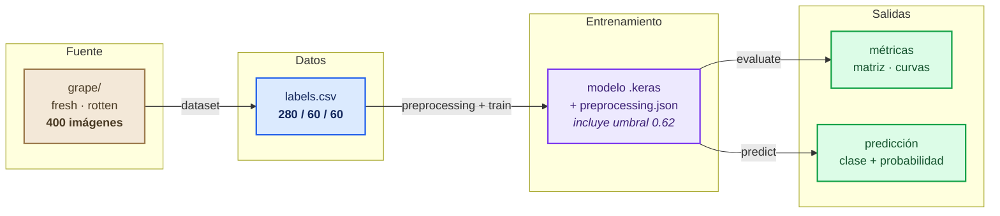
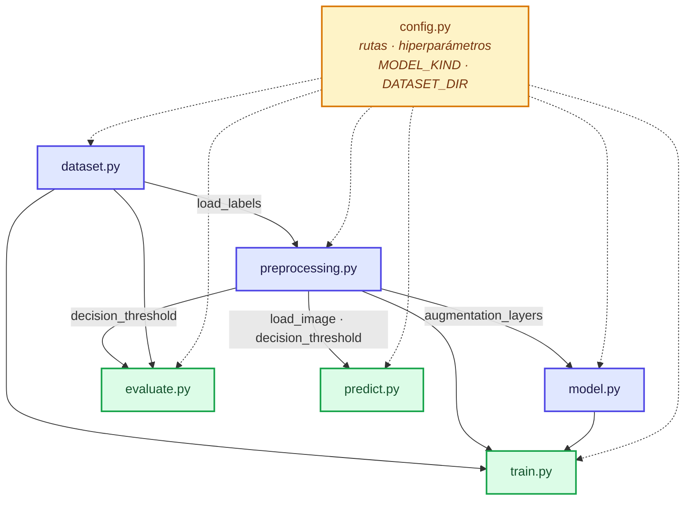
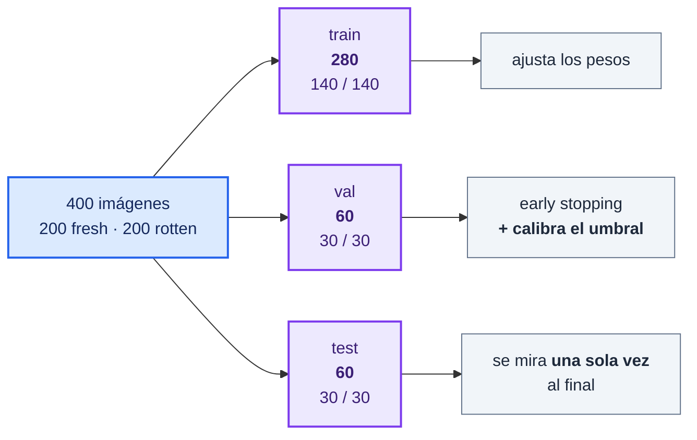
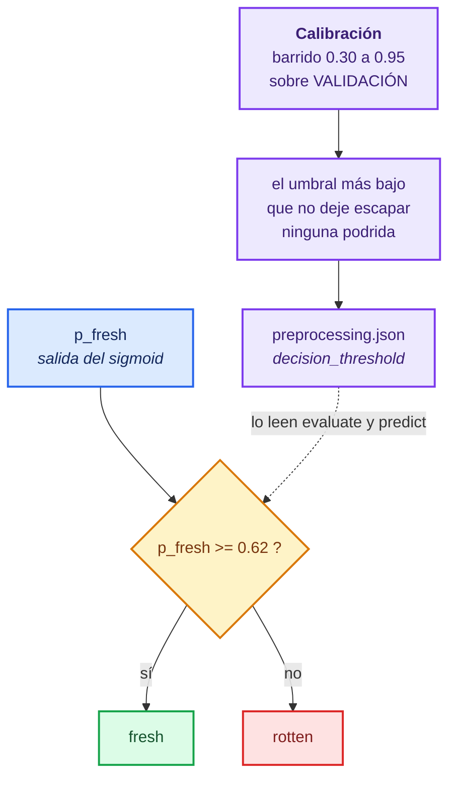
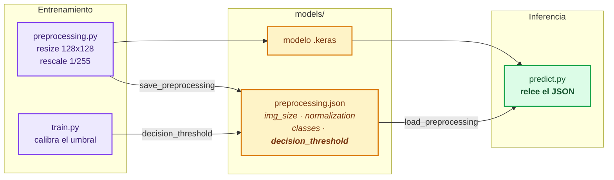

# Arquitectura del proyecto

Clasificador binario de uvas **fresh / rotten** a partir de imágenes, con transfer
learning sobre MobileNetV2. Este documento explica cómo está armado el proyecto y por
qué se tomó cada decisión.

**Estado actual:** accuracy 0,983 en test, con 0 uvas podridas clasificadas como
frescas. Resultados completos en [`reports/report.md`](reports/report.md).

---

## 1. Vista general

El proyecto es un pipeline lineal. Cada etapa es un módulo ejecutable
(`python -m src.<modulo>`) que lee lo que dejó la anterior y escribe un artefacto en
disco. No hay orquestador ni estado compartido en memoria: **el contrato entre etapas
son los archivos**.



`prepare_data.py` queda del dataset anterior (descomprimía el archivo de GrapeNet) y
ya no forma parte del flujo principal.

---

## 2. Módulos

| Módulo | Responsabilidad | Produce |
| --- | --- | --- |
| `config.py` | Rutas, clases, hiperparámetros, semilla, arquitectura | — |
| `dataset.py` | Arma `labels.csv` y reparte los splits 70/15/15 | `data/processed/labels.csv` |
| `preprocessing.py` | Redimensiona, normaliza, aumenta y construye los `tf.data` | `models/preprocessing.json` |
| `model.py` | Define y compila la red (transfer o CNN propia) | — |
| `train.py` | Entrena, **calibra el umbral** y guarda artefactos | `models/*.keras`, `history.json` |
| `evaluate.py` | Métricas, matriz de confusión y curvas | `reports/*.png`, `metrics.json` |
| `predict.py` | Inferencia sobre imágenes sueltas | stdout |
| `prepare_data.py` | Descomprime el archivo de GrapeNet (dataset anterior) | `data/raw/<clase>/` |

### Dependencias entre módulos



`config.py` no depende de nadie y todos dependen de él (líneas punteadas). Dos
opciones concentran las decisiones grandes:

- **`DATASET_DIR`** — carpeta con una subcarpeta por clase. Cambiar de dataset es
  cambiar esta línea.
- **`MODEL_KIND`** — `"transfer"` (MobileNetV2, por defecto) o `"cnn"` (red propia).

---

## 3. El dataset

`grape/` con 400 imágenes únicas, 200 por clase. Verificado antes de entrenar: sin
duplicados exactos, tamaños variados y —lo más importante— **brillo medio casi
idéntico entre clases** (147,7 fresh contra 142,8 rotten), así que el modelo no puede
separar las clases por luminosidad y está obligado a mirar la textura.



El reparto es **70 / 15 / 15** y estratificado, así que las clases quedan balanceadas
en los tres conjuntos y la accuracy se interpreta directamente: una línea base trivial
daría 0,500.

El split se calcula agrupando por `base_id`. Acá cada archivo es una imagen distinta,
así que equivale a un split estratificado normal; la lógica se conserva porque protege
el caso de un dataset con varias variantes de la misma foto. En el dataset anterior
(GrapeNet) eso era crítico: traía 25 variantes aumentadas de cada foto y un split por
archivo habría producido fuga de datos. Dos tests lo verifican.

---

## 4. La red

```mermaid
flowchart LR
    IN["Imagen<br/>128x128x3"]
    AUG["Augmentation<br/><i>solo en train</i><br/>flip · rotación · zoom"]
    RESC["Rescaling<br/>[0,1] a [-1,1]"]
    BASE["<b>MobileNetV2</b><br/>ImageNet<br/><i>congelada</i><br/>2.257.984 params"]
    GAP["GlobalAvgPool<br/>+ Dropout 0.3"]
    OUT["Dense 1 · sigmoid<br/><b>1.281 params</b>"]
    TH["umbral <b>0.62</b>"]
    RES["0 = rotten<br/>1 = fresh"]

    IN --> AUG --> RESC --> BASE --> GAP --> OUT --> TH --> RES

    classDef io fill:#dbeafe,stroke:#2563eb,stroke-width:2px,color:#14285c
    classDef aug fill:#fef3c7,stroke:#d97706,stroke-width:2px,color:#78350f
    classDef frozen fill:#e2e8f0,stroke:#475569,stroke-width:2px,color:#0f172a
    classDef head fill:#fce7f3,stroke:#db2777,stroke-width:2px,color:#831843
    classDef res fill:#dcfce7,stroke:#16a34a,stroke-width:2px,color:#14532d

    class IN io
    class AUG,RESC aug
    class BASE frozen
    class GAP,OUT head
    class TH,RES res
```



**Solo se entrenan 1.281 parámetros de 2.259.265** (el 0,1%). Con 280 imágenes de
entrenamiento, ajustar 2,2 millones de pesos sería sobreajustar garantizado; las
features de ImageNet se reutilizan tal cual y solo se aprende a combinarlas.

`EarlyStopping` sobre `val_loss` con `patience=8`. Sobre `val_accuracy` no servía: con
60 imágenes de validación esa métrica avanza a saltos de 1,7% y cortaba el
entrenamiento mientras la pérdida seguía bajando.

---

## 5. El umbral de decisión

**No todos los errores cuestan lo mismo.** Dejar pasar una uva podrida como fresca es
grave; descartar una sana solo cuesta fruta. Un umbral de 0,5 trata ambos errores como
equivalentes, que es una decisión implícita y equivocada.



El umbral **no está hardcodeado**: `train.py` lo barre sobre validación (nunca sobre
test) y elige el más bajo que no deje escapar ninguna podrida, desempatando por
accuracy. Con este dataset quedó en **0,62**.

| Umbral | Podridas detectadas | Frescas correctas | Escapan | Accuracy val |
| ---: | ---: | ---: | ---: | ---: |
| 0,50 | 29/30 | 29/30 | **1** | 0,967 |
| **0,62** | **30/30** | 28/30 | **0** | **0,967** |
| 0,80 | 30/30 | 25/30 | 0 | 0,917 |

Elimina el error caro sin costar accuracy. Resultado en test: matriz `[[30, 0], [1, 29]]`
— ninguna podrida pasa, una sana se descarta de más.

---

## 6. El contrato de inferencia

La trampa clásica de un clasificador de imágenes es que en producción se preprocese
distinto que en entrenamiento. Acá se evita guardando los parámetros junto al modelo,
**incluido el umbral**:



---

## 7. Qué se versiona y qué no

```
grape_quality_classifier/
├── src/                    [si]  código
├── tests/                  [si]  tests
├── reports/                [si]  informe, métricas y gráficas
│   ├── report.md
│   ├── metrics.json
│   ├── confusion_matrix.png
│   └── training_curves.png
├── data/
│   ├── metadata/*.csv      [si]  metadatos de GrapeNet, dan trazabilidad
│   ├── raw/                [no]  imágenes del dataset anterior
│   ├── processed/          [no]  labels.csv es regenerable
│   └── external_test/      [no]  imágenes de prueba
├── grape/                  [no]  dataset actual, 400 imágenes
├── data_to_test/           [no]  fotos sueltas para probar a mano
├── models/                 [no]  .keras y .json regenerables
├── .venv/                  [no]  entorno local
└── requirements.txt        [si]  versiones fijadas
```

El criterio: **se versiona lo que no se puede regenerar** (código, decisiones,
resultados del informe) y se ignora lo que sí (datos, modelo, entorno). Por eso
`requirements.txt` tiene las versiones clavadas: es lo que hace regenerable al resto.

---

## 8. Reproducir el pipeline completo

```bash
python -m venv .venv
.venv\Scripts\activate
pip install -r requirements.txt

python -m src.dataset           # labels.csv + splits 70/15/15
python -m src.train             # entrena, calibra el umbral -> models/
python -m src.evaluate          # métricas -> reports/
python -m src.predict <imagen>  # inferencia
python -m pytest tests/
```

Con `SEED = 42` fijo en `config.py`, el split y la inicialización son deterministas.

Para entrenar con otro dataset: armá una carpeta con subcarpetas `fresh/` y `rotten/`,
apuntá `config.DATASET_DIR` ahí y volvé a correr `dataset` y `train`. El umbral se
recalibra solo.
